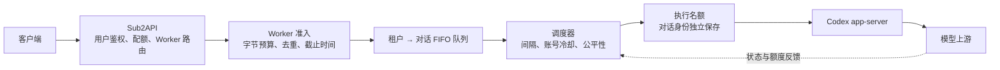
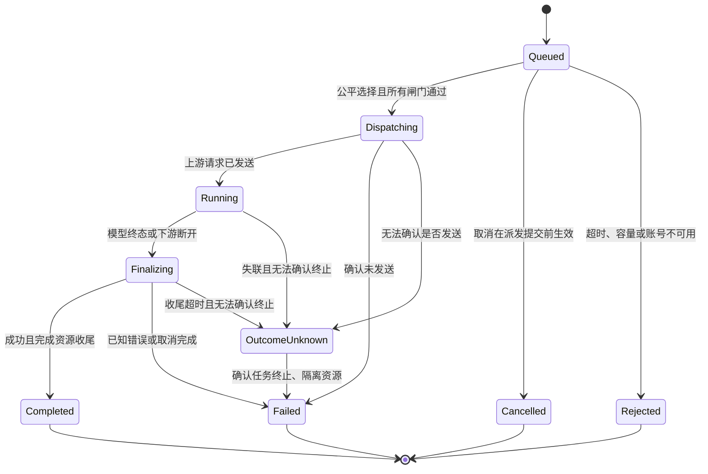

# Codex Worker 会话排队与请求节奏设计

状态：完整目标设计；单 Worker 后续阶段已在本地实现并验证，尚未部署 `.13`。日期：2026-09-16。

当前实现范围：有界公平排队、工具/用户/未知分类间隔、429/5xx/401 反馈、空闲身份回收与旧绑定拒绝、持久派发去重和账号冷却、原始执行期限内取消/断连收尾、暂停/恢复、网关剩余预算与真实 usage 收集。缺少可证明的 raw 上游取消能力时仍采用未知请求占位隔离，不承诺强制停止模型计算。多机共享账号、成本加权和管理 UI 属于按需规模化部分；当前保持单账号单 owner。

审阅拆分（当前工作树包含前一阶段未提交内容）：① `scheduler.rs`、准入/生命周期与纯调度测试；② `queue_signals.rs`、raw 字节观察与 HTTP 间隔测试；③ app-server 响应头白名单、`queue_throttle.rs` 与限流测试；④ `queue_store.rs`、重启/失效绑定测试；⑤ Sub2API 稳定 ID、剩余预算和 usage 收尾；⑥ 镜像配置与操作说明。最小可落地部分是原有有界队列；后续模块按此顺序审阅，避免把超过 800 行的整个工作树当成一个改动。实际启用约束以 README 为准，以下仍是完整目标设计。

适用链路：客户端 → 本地 Sub2API → 192.168.1.13 Codex Worker → Codex app-server → 模型上游。

## 1. 建议方案与边界

采用“账号总量限制 + 租户公平调度 + 对话串行队列 + 有条件的最小间隔”。排队器放在 Worker 的 Responses 入口与 app-server 之间，最终上游连接仍由 Codex 建立。

调度对象是一条客户端 `/v1/responses` 请求。用户的一轮任务可能包含多条这样的请求：模型提出工具调用，客户端执行工具，再把结果送回模型。Worker 不执行工具、不替客户端生成下一次请求、不改写历史。

“贴近真实工作状态”具体指：同一对话有序推进、工具返回后及时继续、空闲时释放执行名额、维持对话身份、遇到上游限流后退让。正常 Codex 工具循环没有可据此承诺的固定“人类等待秒数”；下文间隔是可测量、可调整的工程初值，不是官方额度或规避限流的保证。

第一版按一个 Worker 对应一个上游账号设计。多个 Worker 若共享同一账号，它们必须共享账号级限额和冷却状态；否则只是把突发流量拆到多个进程，无法控制账号总量。

## 2. 当前实现与缺口

以下结论来自本地源码（基线 `3370d9b032`），本次未重新核验远端镜像版本；上一轮联调时 `.13` 的 HTTP 与 SSH 均不可达。

| 现状 | 排队设计必须解决的问题 |
| --- | --- |
| `src/lib.rs` 为每个 HTTP 请求创建线程，完整读取 body 后调用 `SessionPool::acquire` | 并发模型请求虽受池限制，等待线程、请求体内存和等待时间仍缺少入口上限 |
| `src/session_pool.rs` 默认有 5 个 ephemeral thread，使用 Mutex/Condvar 等待 | 没有 FIFO 保证、租户公平性、取消、排队超时、冷却时间 |
| 会话 affinity 与这 5 个执行 slot 绑定，空闲 slot 可被另一个 key 重绑 | 第 6 个及更多对话可能改变已有对话的上游 thread/window 身份 |
| `src/affinity.rs` 从 body metadata 提取会话标识，没有租户命名空间 | 不同用户使用相同客户端 ID 可能共享队列和身份绑定 |
| `raw_response_stream.rs` 已使用有界的响应块通道 | 应保留背压；排队改造不能改成完整缓存 SSE |
| raw app-server 首包等待、块间空闲超时使用 provider 的 stream_idle_timeout_ms（默认 300 秒）；代理 raw 控制等待上限为 3600 秒 | 控制超时不等于 HTTP 首包超时，更不等于可以排队一小时 |
| app-server raw 响应头白名单目前仅包含 `x-codex-turn-state` | Worker 不能直接依靠目前收到的头实现完整的 Retry-After/额度反馈 |
| Sub2API 已有用户/账号名额等待；严格转发使用 `context.WithoutCancel` | 可能出现双重排队；客户端离开后，尚未执行的请求仍可能继续运行 |

现有 `SUB2API_INTEGRATION_PLAN.md` 有历史描述，实施时以当前代码和本设计的明确决策为准。例如鉴权与池容量已经有后续实现，不能再当作完全未实现的功能。

## 3. 层次与所有权



- Sub2API：决定“谁可以使用哪个账号”，保留用户配额和收费职责。
- Worker：决定“这个账号何时发出下一条请求”，拥有唯一的模型执行等待队列。
- 对话注册表：保存对话到真实 app-server thread 的绑定，不把“暂时没有模型请求”当作对话结束。
- app-server：保留现有身份、认证、请求传输；无需在 `codex-core` 新增一套队列。

Sub2API 的用户级限制仍有效，但严格 Worker 账号应使用独立的入口容量语义，不再把“Worker 排队连接数”误当作“正在推理数”。不能直接把 Sub2API 账号并发设成 2：它会把其余请求挡在 Worker 之外，使 Worker 看不到完整需求，无法实现公平性。建议将该账号入口上限明确配置为 Worker 的执行数加等待数，并取消该路径的长时间二次等待；满额快速拒绝。用户级等待预算、Worker 等待预算合并计入同一个总截止时间。

## 4. 对话识别、隔离与粘性

队列键采用 `(gateway_id, principal_id, conversation_id)`，其中 principal 必须来自 Sub2API 已认证的用户或明确的租户身份，不能由客户端任意自报。

建议 Sub2API 在替换 Worker 认证头后附加内部调度信封：`request_id`、`principal_id`、可选的规范化 `conversation_id`、已消耗的等待预算。通过保留前缀的内部 HTTP headers 传递；Sub2API 先删除客户端同名前缀，再根据认证上下文生成。Worker 只接受经过现有 Worker 认证/受控内网入口的信封，信封不会进入 `rawResponsesHeaders` 或上游请求体。必须核对迁移镜像的 Nginx 鉴权终止和清除 Authorization 的行为，不能仅信任一个可伪造的 `trusted=true` 字段。

会话标识规则：

1. 优先使用可信网关已规范化的 conversation ID。
2. 兼容客户端 body 时优先取明确的 `thread_id`，其次 `conversation_id`，最后 `session_id`；读取已支持的平铺/嵌套 metadata。相同字段的重复来源相互矛盾时拒绝，不能悄悄改绑定。不同类型的 ID 可以本来就不同。
3. `previous_response_id` 仅用于查询已有、同租户的 response → conversation 映射；不能直接把每次变化的 response ID 当作新会话键。
4. 不能把 IP、模型名、`prompt_cache_key` 或每次推理都变化的 inference-call ID 当作对话 ID。
5. 没有稳定标识时按独立请求处理，仍受租户和账号限制，但明确不能保证“同一真实对话”的串行和间隔。提供可观测的 weak-identity 计数。

现有 key 优先级与新规则不同，切换只能在排空后进行，避免运行中把同一个对话拆成两条队列。

对话绑定与执行名额分离：例如保留最多 32 个驻留对话，但只有 2 个同时执行。工具运行期间保留该对话的身份，不占用执行名额。正在运行、正在收尾或有等待请求的绑定绝不回收。

空闲 TTL 只卸载已结束的线程，逻辑身份另外持久化。正常重启后通过 thread/resume 恢复原身份。只有映射确实缺失、过期或因未知结果失效时，才检查请求是否包含完整独立上下文；带 previous_response_id、conversation、turn-state、item_reference 或缺少对应调用的工具输出，仍返回 `conversation_binding_lost`，不能自动换 thread。

使用有界的绑定、response 索引和失效记录，并包含 Worker 启动 epoch。驻留上限耗尽且没有安全可回收项时拒绝新对话，不能无限创建 app-server thread。thread 回收必须验证真实 app-server 生命周期；`thread/unsubscribe` 是否足以释放 ephemeral thread，不能凭名称推断。

## 5. 请求间隔：按前一个请求完成时间计算

同一对话同时最多一条请求处于 `Dispatching / Running / Finalizing / OutcomeUnknown`。同一对话的后续请求进入 FIFO，不得越过队首。已确认结束的成功和失败尝试都会更新最后结束时间；派发前拒绝不更新它，失败还可能触发更长的账号冷却。

定义：

```text
conversation_ready_at = previous_upstream_finished_at + gap(request_kind)
eligible_at = max(conversation_ready_at, account_next_start_at, account_cooldown_until)
```

只有当前时间达到 eligible_at、存在可用名额、未过截止时间时才发送 `turn/start.rawResponses`。使用单调时钟。不能先拿名额再 sleep；冷却中的 A 对话不得阻塞已经可运行的 B 对话。

间隔从上次模型请求完成起算。客户端已经执行了 5 秒工具，就已经自然满足 300 毫秒的工具续接间隔，不再额外睡 300 毫秒。第一次请求也不人为增加“上一轮间隔”。同一对话的首个请求仍受账号启动间隔约束。

请求分类：

| 类型 | 可用证据 | 建议最小间隔 |
| --- | --- | --- |
| 用户新一轮 | 可信客户端 turn 边界，或能确认的新追加用户输入 | 1500 ms |
| 工具续接 | 新增工具输出匹配上一响应尚待返回的 call ID，且绑定同一对话 | 300 ms |
| 压缩/其他续接 | 经过验证的专用标记或协议行为 | 300 ms，但不绕过账号限制 |
| 无法确认 | 通用客户端、全量历史、缺少 turn 信息 | 800 ms，不获得续接优先权 |

不能因为整个历史里“出现过 function_call_output”就判定为工具续接。旁路观察只保留有限的待完成 call ID、最近响应 ID/输入摘要，不保存另一份无界对话历史。信号缺失、观察事件超限或解析失败时降级为 Unknown，不改变请求和 SSE。

客户端已经自然产生的停顿应计入间隔。不要在每个 SSE token/chunk 之间加延迟。默认不加入随机“人类思考时间”；只有限流恢复和重连退避使用有界抖动，以防多个请求同时恢复。

第一版只覆盖当前已支持的 HTTP `/v1/responses`。压缩分类不代表新增 `/responses/compact` 支持，WebSocket 也不能自动视为已受这套队列控制。后续新增传输必须接入同一个账号限额；`/models`、健康检查和取消接口走独立、有界的控制路径，不等待模型执行名额。

例：A 的响应在 8.0 秒结束，工具在 9.2 秒完成，A 的续接在 9.2 秒即可竞争名额。若工具在 8.1 秒完成，则等到 8.3 秒；这 0.2 秒里其他就绪对话可以运行。

## 6. 公平调度与并发

第一阶段使用两级轮转：先选租户，再选该租户的就绪对话。每个对话只把队首放入 ready 集合，未到间隔的队首先进入时间堆。新请求直接执行也必须经过调度器，不能抢过已经排队的请求。

实现上让一个调度状态拥有者处理入队、取消、完成和计时事件；网络 I/O、身份创建及 JSON 处理放在有界执行资源中，不在调度锁内完成。可保留 tiny_http 和既有 raw 转发器，但必须替换入口的无界逐请求线程，并验证 tiny_http/Nginx 自身的等待连接与上传资源限制。执行名额在 Dispatching 时原子预留，真正发送时记录启动时间；准备失败归还名额，发送结果不明则进入未知状态。动态降低上限时允许已有运行数暂时高于新上限，但停止补发。

相同条件下，已经验证的工具续接可以获得一次有限优先机会；同一对话最多连续获得两次派发机会，之后让其他就绪对话先行。没有竞争者时不必故意闲置。客户端自报的类型不能提升优先级。

有多个租户竞争时，优先给尚无运行请求的租户机会。单租户可以借用空闲执行名额，但不能抢占已运行流。队列等待时间用于 aging，避免新来的工具续接长期压过普通请求。

轮转公平是“派发机会公平”，不是 token/运行时长完全相等。第二阶段可根据实际占用秒数和 token 消耗加权；模型返回 usage 前只有估计，不能声称精确按 token 排队。长流不能中途强制切片，因此所有执行名额被长任务占用时仍需等待或超时，不能承诺固定的最大成功等待时间。

账号级控制至少包括：最大在途数、相邻请求启动间隔、冷却截止时间。令牌桶如用于启动速率，应取 burst=1，避免长时间空闲后攒出五条瞬时请求。已知上游请求/令牌额度可以作为额外闸门；不能从“池有 5 个 thread”推导上游允许 5 并发。

## 7. 准入、有界资源与截止时间

进入执行队列之前完成鉴权、路由检查、body/metadata 格式和资源预算检查。无效请求不占模型执行名额。

- 限制 body 字节数、同时接收的 body 总量、队列条数、等待 body 总量、每租户和每对话 pending 数。
- Content-Length 未知或不可信时增量计数，超过上限立即停止接收；分块传输不能绕过限制。
- 队列只保存一份原始 body；JSON 解析、身份重写的额外内存另有预算。原始字节上限不等于进程 RSS 上限。
- 固定大小的准入/转发执行资源，禁止一条等待请求对应一个无界增长的 OS 线程。保留有界流通道和慢读端写入截止时间。
- 对话注册表、去重表、call ID 集合、response 索引、内部取消 tombstone、日志和状态查询均须有容量与 TTL。

将下列时间分别记录和限制：接收请求、排队、等待上游响应头、流空闲、请求总时长、取消后收尾。前序网关已经等待的时间要扣除；跨主机传递剩余预算并保守扣除链路耗时，时钟偏差不得把预算延长。

```text
排队 + 连接/派发 + 上游首包等待 < 全链路最小首包等待预算
整个请求耗时 < 客户端/网关约定的总截止时间
```

当前 provider 上游空闲限制和 3600 秒控制限制要单独保留其语义。队列等待上限 120 秒并不自动证明客户端能等足够久；真实 CLI/SDK、Sub2API、Nginx 的超时必须一起验收。预算不兼容时缩短排队或显式调整测试客户端配置，不能靠注入假 SSE 保活。

## 8. HTTP/SSE 契约

排队期间保留原 HTTP 请求，不发送伪造 `response.created`、排队事件或 SSE 心跳，也不提前发送 HTTP 200。一旦提前提交响应头，就无法正确返回后来的 429/503 或上游状态码。

真正收到上游状态和响应头后才开始现有原字节转发。排队状态通过受控管理接口观察；普通 Codex 客户端可能只显示“等待响应”。可追加内部诊断响应头或 `Server-Timing`，但不是让客户端实时看到队列位置的承诺。

| 派发前情况 | HTTP 与错误码 | 是否发生模型执行 |
| --- | --- | --- |
| 请求格式/内部信封无效 | 400 `invalid_request` | 否 |
| 请求过大 | 413 `request_too_large` | 否 |
| 用户/对话 pending 超限 | 429 `queue_limit_exceeded` | 否 |
| Worker 全局队列或驻留资源满 | 503 `worker_overloaded` | 否 |
| 排队预算用尽 | 503 `queue_deadline_exceeded` | 否 |
| 账号处于额度冷却 | 429 `account_cooldown`，合法 Retry-After | 否 |
| Worker draining、账号不可用 | 503 `worker_unavailable` | 否 |
| 相同幂等请求仍运行/结果不可重放 | 409 `request_in_progress` / `request_already_completed` | 不再次执行 |
| 原对话身份已丢失 | 409 `conversation_binding_lost` | 否 |

真实上游 4xx/5xx 保持上游状态、允许头和错误 body；不能把它们改成上述本地拒绝。SSE 中的 `response.failed` 即便 HTTP 为 200 也须归为失败。原字节观察器可以更新状态，但不能吞掉或重新序列化事件。读取到普通 EOF 也不能一律认为模型成功，应区分协议终态与截断。

## 9. 取消、断连与状态机



取消与派发必须经过同一原子状态转换。取消先赢则不发送；派发先赢则进入执行后的取消/收尾路径，不能假装仍未执行。所有资源由一次性 guard 归还，重复取消、重复完成通知不能重复减计数。

Sub2API 当前会解除上游 context 的取消，Worker 仅看 HTTP 连接不足以知道原客户端已离开。建议通过可信 request ID 增加幂等内部取消接口：`POST /internal/scheduler/requests/{id}/cancel`。网关在客户端离开时发出取消通知；该接口不转发模型请求。取消比入队更早到达时记录有界、短 TTL 的 tombstone，入队时检查。还需有最长接收期限，以避免迟到请求越过 tombstone。

排队中取消：删除队列项、释放 body 预算，不计模型费用。暂未接通显式取消时，只能承诺排队截止时间兜底，不能宣称客户端离开立即生效。

执行中断开：立即禁止重复执行，按有限时间继续读取终态 usage，收尾不超过原始 3600 秒执行期限。上游结束则正常记录真实消耗；达到上限后使用经过验证的 raw RPC 取消能力。如果没有可确认的取消能力，标记 OutcomeUnknown，隔离对应 thread 并将这项消耗继续计入账号在途占用，暂停不安全的新派发，直到终止已确认。不能因 HTTP 写失败就把实际仍在运行的名额归还。

不能直接假设普通 `turn/interrupt` 能取消这条 `rawResponses` RPC，也不能把关闭 WebSocket 自动等同于上游已停止。该能力必须通过 app-server 生命周期测试证明，必要时增加受 request ID 约束的内部取消协议。上游取消本身也不保证不计费。

同一对话的队列顺序只保证接收顺序，不替并发客户端修复因果关系。若两条并发请求携带同一旧历史，串行执行仍可能语义冲突；有可信 predecessor/turn 信息时拒绝冲突，否则要求客户端本身保持顺序，Worker 不修改 body 来补历史。

## 10. 重试、去重与费用

第一版保留“一个客户端请求最多一次上游尝试”。队列等待不是重试；冷却结束只允许尚未派发的请求竞争，不把刚失败的请求静默重新执行。

幂等键优先使用客户端明确的稳定 request/Idempotency 标识，其次经过验证的 inference-call ID，并与租户、对话和原始请求摘要绑定。相同 key 不同 body 返回冲突。只有 Sub2API 每次重新生成的 request ID，不能解决客户端重连产生的重复请求；仅 body 相同也不能证明是重复请求。

流响应第一版不缓存重放、不合并给多个客户端。已派发的重复请求返回 409 和内部状态引用，不能再执行一次来“补回复”。去重表有界，保留期覆盖约定重试窗口；超出容量时不能淘汰仍在途记录来腾位置。第一版重启会失去部分内存状态，无法宣称跨重启 exactly-once；恢复阶段对旧 epoch 请求和绑定显式报错。需要跨重启保护时增加小型派发状态日志，记录 ID/摘要/状态，不持久化完整 prompt 或 SSE。

Sub2API 严格路径及其外层 handler 都需检查重试/换号行为。第一版不自动 failover；后续只有 Worker 明确返回“派发前拒绝”、且新账号与会话依赖兼容时才允许单独设计换号策略。已经写出响应、提交 RPC 或结果未知时不自动重发。

费用规则：队列拒绝与排队取消不进入成功 usage 记账；执行过的失败也可能有 usage；客户端已断开但上游完成仍按真实 usage 处理。拿不到终态时记录 `usage_unknown`，不能把缺失数据写成确定的 0 tokens。费用由 Sub2API 负责，Worker 的去重/派发账本用于关联，不再创建第二套扣费系统。

## 11. 自适应节流、故障与恢复

需要扩展 app-server → Worker 的有限响应头白名单，至少传递合法的 Retry-After 和已确认格式的额度/重置头。使用现有 raw 响应 headers 容器可以避免不必要的新事件类型；协议和安全测试必须覆盖白名单及长度上限。直接返回给客户端的上游头保持原值，内部解析用单调截止时间。

- 真实 429：优先遵守可靠的 Retry-After/重置时间。适用范围明确时限制对应模型/额度桶；范围未知时保守作用于整个账号。不能盲目把更长的上游建议截短成 30 秒。
- 无合法提示的连续瞬时限流：建议 5、10、20、40、80、最多 120 秒退避，并加小幅抖动；只影响后续未发请求。额度耗尽则等待可信 reset 或人工恢复，不进行频繁半开探测。
- 登录失效/权限失败：将账号置为不可用并拒绝新请求；某个模型无权限或某条请求无效不能不加区分地永久熔断整个账号。
- 连续连接/5xx：单独的可用性熔断，熔断后最多一条真实等待请求作为半开探测，不另发会产生模型费用的健康请求。
- 成功恢复：例如连续至少 60 秒且 20 条请求成功、无新限流后，每个恢复窗口增加 1 个执行名额，最多到人工配置上限。减少并发只影响新派发，不中断现有流。
- 只有队列长而没有限流证据时，不自动增加间隔；否则会把拥堵进一步放大。应拒绝超出等待预算的流量并报告容量不足。

恢复期间全局启动间隔继续生效，不能把整批积压请求同时放出去。队列中等待期限不足以覆盖已知冷却的请求可以提前拒绝，避免占内存等到必然超时。

## 12. 建议初始配置

这些值用于单账号小规模试运行，需按服务器内存、平均响应时长及真实额度调整；不是对远端承载能力的测量结果。

| 配置 | 初值 | 含义 |
| --- | --- | --- |
| 账号最大执行数 | 2，人工可降至 1；初期上限 5 | 5 是现有池的参考值，不代表额度 |
| 单对话执行数 | 1 | 包括未确认完成的请求 |
| 账号请求启动间隔 | 300 ms，burst=1 | 限制跨对话瞬时突发 |
| 用户轮次 / 工具续接 / Unknown 间隔 | 1500 / 300 / 800 ms | 前次上游结束到下次发送的最小值 |
| 全局 pending | 24 | 不含已经执行的请求，接收阶段也预占准入名额 |
| 单租户 / 单对话 pending | 8 / 2 | 防止一个用户或对话塞满队列 |
| 队列最长等待 | 120 s | 还受全链路剩余预算约束 |
| 单请求 body | 32 MiB | 与当前 Nginx 上限一致，Worker 也独立执行 |
| 等待 body / 全部驻留原始 body | 64 / 128 MiB | 解析/重写另有限额，不能当作 RSS 上限 |
| 驻留对话数 / 空闲 TTL | 32 / 15 min | 不回收运行中或有 pending 的绑定 |
| 去重记录 | 最多 4096，结束后保留 10 min | 在途记录不得按 TTL 淘汰；不是无限期去重 |
| 每对话待匹配工具 ID | 最多 64，5 min | 超限或过期降级 Unknown |
| 下游断开后的 usage 收尾 | Worker 不超过原始 3600 s 执行期限；Sub2API 15 s | 未知请求保留并发占位并隔离其会话，其他会话使用剩余容量 |

这些参数不能全部独立乱调：pending 必须同时通过条数与字节预算，最大并发必须不超过实际可用身份/内存/账号额度。若平均模型请求耗时 30 秒、并发 2，则忽略其他开销时吞吐上限约为每分钟 4 条请求；这不是每分钟 4 个用户任务。24 条排队请求远不一定能在 120 秒内完成等待，队列长度是突发保护上限，不能当作成功接纳能力。ETA 仅作近似估计，不能保证完成时间。

## 13. 运维、重启与多 Worker

指标分别记录入队耗时、排队耗时、上游首包时间、模型运行时间、下游写入和收尾时间；展示 p50/p95、队列数量/字节、活跃对话、运行数、冷却原因/剩余时间、拒绝/取消/未知 usage 数和真实 429。不能把新增排队时间混进“模型首 token 时间”。

标签只使用有限枚举、账号/模型等受控维度，避免 request ID、对话 ID 或用户 prompt 成为高基数 metrics 标签；诊断日志只记录脱敏 ID 和 bounded 字段，不记录凭证、turn-state 或请求正文。

增加受控 `/internal/scheduler/status`、请求状态、暂停/恢复接口。队列位置可能因公平调度变化，管理界面应显示大致等待状态和原因。`/healthz` 表示存活，`/readyz` 表示是否能接纳；当前 Nginx 固定 200 的 healthz 不能代表 app-server、登录态和调度器都正常。

优雅停止：先标记 draining，拒绝新请求，未派发请求返回明确的未执行错误，运行请求在宽限内完成，最后确认终止或记录未知结果。迁移镜像当前 30 秒 stop grace 应与请求收尾策略一致。新进程创建新 epoch，不自动重放旧排队请求，不承诺恢复旧 ephemeral thread。

多个独立账号可以由 Sub2API 路由，但同一对话默认粘在原账号与 Worker。相同账号的多个副本必须用共享调度租约和冷却/额度状态；单纯 Redis 锁过期不代表旧上游调用已停，不能在租约失效后立即在另一副本重发。第一版推荐一个账号只运行一个调度 owner，避免过早引入分布式队列。

## 14. 实施拆分与验收

每阶段保持独立、可回滚，复杂逻辑单次变更尽量小于 500 行，不将所有功能塞进 `src/lib.rs` 或 `codex-core`。

1. **可观测与契约准备**：记录实际客户端会话/turn 标识和超时配置（只记录字段存在性及脱敏摘要）；明确内部 principal/request ID、取消语义、限流头传递。先观察现有请求节奏，不改变派发。
2. **首个可试用版本**：有界准入、按租户/对话 FIFO、单对话串行、账号名额/启动间隔、Unknown 默认间隔、超时和派发前取消。分离身份与名额，避免五槽位重绑。Sub2API 同步接入入口容量与取消通知。完成这些后才声称队列可试用。
3. **工具循环与反馈**：增加有界工具续接识别、有限优先、Retry-After/429 冷却、账号故障状态与可验证的执行中取消/usage 收尾。执行中取消未验证时保留明确的未知状态与保守停派发策略。
4. **恢复与规模化**：去重持久状态、多 Worker owner、时长/成本公平、管理界面。按实际需求开启，不作为单机排队的前置依赖。

建议在本 crate 新建私有 `scheduler/`、`admission.rs`、`conversation_registry.rs` 和对应独立 `*_tests.rs`；保留 `raw_response_stream.rs` 的转发职责。必要的 app-server 扩展放在已有 raw 请求处理边界，优先复用响应 headers 和取消生命周期。新增 CLI/配置遵守现有规则，只有确实更改 app-server API 形状才再生成对应 schema。

验收必须覆盖：

- 同对话永不重叠且 FIFO；不同对话能并行；工具间隔从上一响应结束计算；冷却中的队首不阻塞其他对话。
- 5 个以上对话不会悄悄共享/改绑真实 thread；两租户使用相同客户端 ID 完全隔离；未知 identity 行为有明确限制。
- 热门租户/连续工具调用不会无限插队；长流下拒绝/超时符合契约，不虚假承诺等待成功。
- 队列条数/字节/接收线程均有硬上限；分块 body、超大 metadata、慢上传、慢读端不能绕过限制。
- 入队前/排队中/派发边界/流中四类取消及竞态；异常、断连、重复完成不会提前归还或重复释放名额。
- 本地 429/503/409 与真实上游错误可区分；排队不提前发送 200；JSON/SSE 字节保持原状；超大观察事件降级不破坏转发。
- 真实 429、长 Retry-After、额度耗尽、账号失效、模型权限错误、网络错误和恢复不产生重试风暴。
- 幂等重复不二次执行；相同正文的不同合法请求不被误去重；流截断与重启后未知结果不被当成成功。
- Sub2API → Worker → 真实 app-server → 模拟上游进行跨进程测试：上游调用次数、派发时刻、身份、取消完成及 usage 关联可核验。
- `.13` 恢复后，用真实 Codex CLI 完成至少三轮“模型 → 工具 → 模型”，再进行两对话并发和排队中取消；确认无额外 prompt/tool 执行、无重复计费。

纯调度测试使用可控时钟和确定的事件推进，不依赖真实 sleep 或大规模模型调用。实现时按仓库要求通过 `just test -p codex-responses-api-proxy` 等受影响项目测试；如果扩展 app-server/protocol，则增加公共 API 行为测试与必要 schema 校验。本次只有设计文档，不运行构建或模型请求。

## 15. 依据与待验证项

本地实现依据：`src/lib.rs`、`src/session_pool.rs`、`src/affinity.rs`、`src/raw_response_stream.rs`、`src/app_server_reader.rs`；Codex 正常工具循环位于 `../core/src/session/turn.rs`，raw 单请求路径位于 `../app-server/src/request_processors/turn_processor.rs` 和 `../core/src/client.rs`；Sub2API 的 `openai_gateway_handler.go` 与 `gateway_usage_billing.go` 决定外层等待和断连行为。

已检索并尝试读取官方 [Rate limits](https://developers.openai.com/api/docs/guides/rate-limits) 及 platform 官方入口，但本次访问均返回 403。因此不将任何间隔、容量或订阅额度数字归因于官方文档。所有建议参数需在 `.13` 恢复、确认镜像版本及客户端实际请求形式后校准。

实施前尚需实测：客户端是否稳定提供 thread/turn/call ID；真实超时预算；raw RPC 断连后的上游取消行为；ephemeral thread 的内存和卸载语义；当前账号实际额度反馈字段；多进程是否共用同一上游账号。上述未知项已有保守处理策略，不以猜测替代验收。

## 会话持久化修复的审查分段

本次补丁按两个有依赖关系的阶段审查：先检查 scheduler / admission / lifecycle 的执行名额与身份分离，以及计时缓存和未知结果保护；再检查 conversations、identity reader、HTTP 接入与持久化恢复测试。第二阶段依赖第一阶段的新 Lease 接口，部署必须包含两个阶段。

会话身份索引使用独占锁、原子替换和账号指纹；最多 4096 项、30 天不活跃保留期，清理时只删除索引管理的闲置线程。独立身份控制错误返回 worker_identity_unavailable 并使 readyz 失败。上线保留原派发日志；已有未确认请求不能借升级自动恢复。
