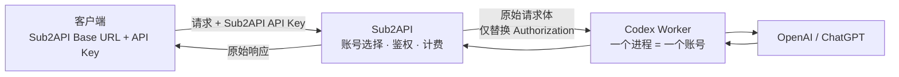

# Sub2API 透明转发集成方案

## 目标

客户端只配置 Sub2API 的 Base URL 和 API key。Sub2API 负责账号选择、用户鉴权、配额和费用统计；Codex 负责实际模型请求。

请求经过 Sub2API，但 Sub2API 不改变请求体，只把客户端的认证信息替换成目标 Codex Worker 的认证信息，并把响应原样返回。

一个 Codex Worker 进程对应一个独立的 `CODEX_HOME` 和一个上游账号。

## 总体架构



请求数据流：

```text
客户端 → Sub2API → Codex Worker → OpenAI / ChatGPT
```

Sub2API 处于请求链路中，因此可以直接读取响应中的 `usage` 并写入现有 usage/billing 体系，不需要 Codex 额外上报 usage。

## 客户端配置

客户端只需要：

```toml
base_url = "https://sub2api.example.com/v1"
api_key = "sk-sub2api-xxxx"
```

客户端不需要知道具体 Codex 账号、Worker 地址或 Worker secret。

## 认证转换

客户端请求：

```http
Authorization: Bearer sk-sub2api-user
Content-Type: application/json

{原始请求体 B}
```

Sub2API 转发到 Worker：

```http
Authorization: Bearer worker-secret-a
Content-Type: application/json

{原始请求体 B}
```

其中 `B` 必须保持完全相同。

HTTP 代理必须改变或重新生成 `Host`、`Content-Length`、`Connection` 等传输字段；这是网络转发行为，不属于模型请求内容变化。

## 连接和 TLS 边界

请求链路包含三段独立连接：

```text
客户端 ── TLS 连接 1 ──> Sub2API
Sub2API ── 内网 HTTP 或 mTLS 连接 2 ──> Codex Worker
Codex Worker ── Codex 自己的 TLS 连接 3 ──> OpenAI / ChatGPT
```

Sub2API 不应直接连接 OpenAI。这样 OpenAI 上游只能看到 Codex Worker 建立的连接，Sub2API 的 TLS ClientHello、SNI、证书、HTTP client、源 IP 和连接池参数不会出现在上游连接中。

Sub2API 到 Worker 的严格转发应清理代理自身的连接信息：

```text
删除：Via
删除：Forwarded
删除：X-Forwarded-For
删除：X-Real-IP
删除：X-Forwarded-Host
删除：X-Forwarded-Proto
删除：X-Powered-By
删除：X-Sub2API-*
```

只保留业务所需的 Codex/OpenAI headers，并替换 `Authorization` 为 Worker secret。不要把 Sub2API 的 User-Agent、Cookie 或内部追踪头传给上游。跨机器部署时，Sub2API 与 Worker 之间使用 HTTPS/mTLS；Worker 到 OpenAI 仍由现有 Codex transport 建立。

不要使用 TCP 层 TLS passthrough。TLS passthrough 虽然能保留客户端连接，但 Sub2API 将无法读取响应 usage，也无法完成账号调度和费用统计。

TLS 指纹无法通过配置保证完全一致，也不应手工伪造其他客户端的 JA3/JA4。验收目标是上游连接中不存在 Sub2API 的域名、证书、IP、HTTP headers 或 User-Agent，并且上游连接确实由 Codex transport 建立。

## 严格透传模式

Sub2API 当前的 `openai_passthrough` 仍可能执行模型映射、reasoning 处理、tool adaptation、Codex metadata 注入和响应修复。因此不能直接把现有开关当作字节级透传模式。

需要新增账号或渠道级开关：

```text
strict_raw_forward = true
```

严格模式的处理规则：

- 读取原始请求 body bytes。
- 原始 bytes 直接发送给 Codex Worker。
- 只替换出站 `Authorization`。
- 不执行 JSON 反序列化后重建。
- 不执行 model mapping。
- 不修改 reasoning、tools、metadata、input、instructions 或 stream。
- 不注入或删除 Codex 字段。
- 不注入 SSE 心跳。
- 不重写 SSE 数据。
- 请求发出后不自动重试或切换账号。
- 响应 body 和 SSE 事件原样返回。

严格模式应在现有 OpenAI handler 的 body normalization、model mapping 和 policy rewrite 之前进入独立分支。普通兼容模式继续使用现有逻辑。

## Sub2API 账号配置

每个 Codex Worker 在 Sub2API 中配置为一个 OpenAI API-key 账号：

```text
platform: openai
type: api_key
base_url: http://codex-worker-a:8787
api_key: worker-secret-a
extra.openai_passthrough: true
extra.strict_raw_forward: true
```

`base_url` 使用 Worker 根地址，不要预先写 `/v1`；Sub2API 会拼接 `/v1/responses`。

多个 Worker 分别对应多个账号：

```text
codex-worker-a → Account A → CODEX_HOME_A
codex-worker-b → Account B → CODEX_HOME_B
codex-worker-c → Account C → CODEX_HOME_C
```

把这些账号加入同一个 Sub2API group，由现有调度器根据可用性、并发和分组规则选择账号。

## Codex Worker 配置

每个进程必须使用独立的 `CODEX_HOME`：

```shell
CODEX_HOME=/var/lib/codex/account-a codex app-server \
  --listen unix:///run/codex/account-a.sock

CODEX_HOME=/var/lib/codex/account-a codex-responses-api-proxy \
  --port 8787 \
  --app-server-socket /run/codex/account-a.sock \
  --worker-api-key worker-secret-a
```

当前 [responses-api-proxy](./src/lib.rs) 没有校验入站 API key，需要增加 Worker secret 校验。Sub2API 发给 Worker 的 `Authorization` 使用该 secret；客户端的 Sub2API key 不应继续传入 Worker。

## Codex 身份字段说明

当前 [rewrite.rs](./src/rewrite.rs) 会把 `installation_id`、`session_id`、`thread_id` 等字段替换为租用 thread 的身份，用于线程隔离和避免不同客户端会话冲突。

因此需要区分两种要求：

1. **Sub2API 到 Worker 的请求体不变**：推荐方案。Sub2API 不修改 body，Codex Worker 内部继续执行现有身份隔离。
2. **端到端 body 字节完全不变**：需要新增 `client_identity` 模式，关闭 Codex 的身份重写。该模式只能用于单客户端或已经自行保证身份唯一的场景，否则可能发生会话串扰。

默认使用第一种模式。

## Token 和费用统计

Sub2API 对响应进行旁路解析：

```text
Worker 响应
  ├── 原始字节直接返回客户端
  └── 解析 response.completed.usage
          ↓
      现有 usage_logs / billing
```

流式 Responses 重点读取：

```json
{
  "type": "response.completed",
  "response": {
    "id": "resp_xxx",
    "usage": {
      "input_tokens": 12000,
      "cached_input_tokens": 8000,
      "output_tokens": 1800,
      "total_tokens": 13800
    }
  }
}
```

Token 映射：

| Codex usage | Sub2API usage |
| --- | --- |
| `input_tokens` | 输入 token |
| `cached_input_tokens` | cache read token |
| `cache_write_input_tokens` | cache creation token |
| `output_tokens` | 输出 token |
| `reasoning_output_tokens` | reasoning 输出 |
| `total_tokens` | 对账字段 |

Sub2API 继续使用自己的模型价格、分组倍率和套餐规则计算费用，Codex 不上传价格。

流式解析必须使用 tee 方式：解析器只观察响应，不重新序列化或修改返回给客户端的字节。客户端断开后，Sub2API 应继续读取上游到终态，以获得最终 usage；确实无法获得时记录 `usage_unknown`，不能猜测 token 数量。

## 请求重试和故障切换

严格透传模式下：

- 上游请求尚未建立时，可以返回连接错误。
- 一旦向 Worker 发出请求，不自动重试。
- 一旦向客户端写出响应，不得切换账号重发。
- 同一个客户端请求只能对应一个 Sub2API usage 记录。

否则一次请求可能实际消耗两个 Codex 账号的额度，但客户端只收到一个响应。

## 需要修改的代码

### Sub2API

新增严格转发分支，建议放在现有 OpenAI Responses handler/service 附近：

- 增加 `strict_raw_forward` 配置。
- 新增基于 `[]byte` 的 raw forward 方法。
- 只替换 `Authorization`，复制必要的请求头。
- 使用响应 tee 同时转发和提取 usage。
- 复用现有 `OpenAIForwardResult`、usage worker pool 和 `RecordUsage`。
- 禁用 strict 模式中的 body rewrite、SSE rewrite、自动重试和 failover。
- 增加响应完成、流中断、HTTP 错误和客户端断开测试。

Sub2API 已有 OpenAI Responses 路由和 usage 记录入口，可在现有结构上扩展：[gateway.go](https://github.com/Wei-Shaw/sub2api/blob/main/backend/internal/server/routes/gateway.go)、[openai_gateway_passthrough.go](https://github.com/Wei-Shaw/sub2api/blob/main/backend/internal/service/openai_gateway_passthrough.go)、[openai_gateway_usage.go](https://github.com/Wei-Shaw/sub2api/blob/main/backend/internal/service/openai_gateway_usage.go)。实现时应固定 Sub2API 版本或 commit，避免依赖 `main` 分支未来变化。

### Codex

- 为 `responses-api-proxy` 增加入站 Worker API key 校验。
- 保留现有 `turn/start.rawResponses` 流式转发能力。
- 默认继续使用 server-side identity rewrite。
- 如确有端到端字节不变需求，再增加显式 `client_identity` 开关。
- 不把 Sub2API 直接作为 OpenAI 上游客户端；由 Codex transport 建立最终上游 TLS 连接。
- 清理 Sub2API 到 Worker 的 `Via`、`Forwarded`、`X-Forwarded-*`、`X-Sub2API-*` 等代理头。
- 增加 Worker 健康检查和优雅退出时的连接处理。
- 保证每个 Worker 使用独立 `CODEX_HOME`、app-server socket 和账号登录态。

当前已提交的基础改动为 `103d23a7f8`：增加 raw Responses 流、请求身份处理、会话池和迁移镜像，已推送到 `private/codex/rust-v0.153.4`。

## 实施阶段

### 第一阶段：单 Worker 透明转发

1. Sub2API 增加 `strict_raw_forward`。
2. 手工配置一个 Codex Worker 账号。
3. 使用固定 JSON fixture 对比 Sub2API 出站 body 与客户端 body。
4. 验证流式和非流式响应字节一致。
5. 验证 Dashboard 出现 input/output/cache token 和费用。

### 第二阶段：多账号分发

1. 每个 Codex 进程建立独立 `CODEX_HOME`。
2. 每个进程对应一个 Sub2API Account。
3. 将账号加入同一个 group。
4. 验证 Sub2API scheduler 在账号之间分发请求。
5. 验证 401、403、429 和 5xx 不会造成重复请求或重复计费。

### 第三阶段：运维能力

增加 Worker 在线状态、并发数、最后心跳、账号关联和 usage 延迟展示。Sub2API 宕机时，严格透传请求会失败；如果需要 Sub2API 暂时不可用仍能服务，则需要额外的本地 usage spool 和独立控制面，这属于后续增强。

## 验收标准

- 客户端只配置 Sub2API Base URL 和 Sub2API API key。
- Sub2API 能选择不同 Codex Worker 账号。
- Sub2API 到 Worker 的请求 body 与客户端 body 完全一致。
- 只有出站认证信息被替换为 Worker secret。
- Worker 返回的 SSE 和 JSON 响应字节保持一致。
- OpenAI 上游连接由 Codex transport 建立，Sub2API 不直接连接 OpenAI。
- OpenAI 上游看不到 Sub2API 的域名、证书、源 IP、User-Agent 或代理 headers。
- Sub2API usage 页面能显示模型、账号、输入 token、输出 token、缓存 token、耗时和费用。
- 同一个请求不会因重试产生两条计费记录。
- Sub2API 解析失败不会修改或阻断模型响应。
- 每个 Codex 进程只使用自己的 `CODEX_HOME` 登录态。
- 客户端断开后仍能尽可能取得终态 usage。
